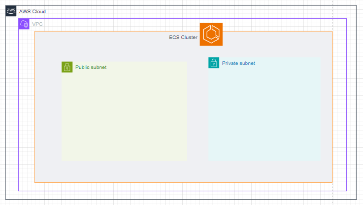
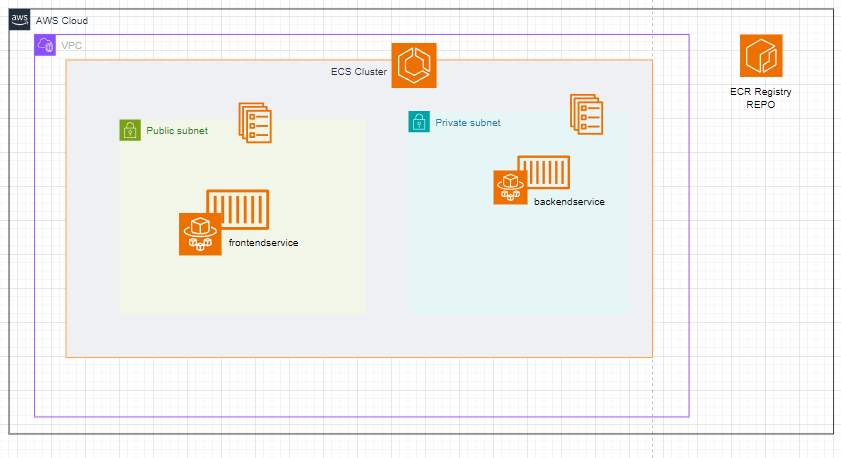
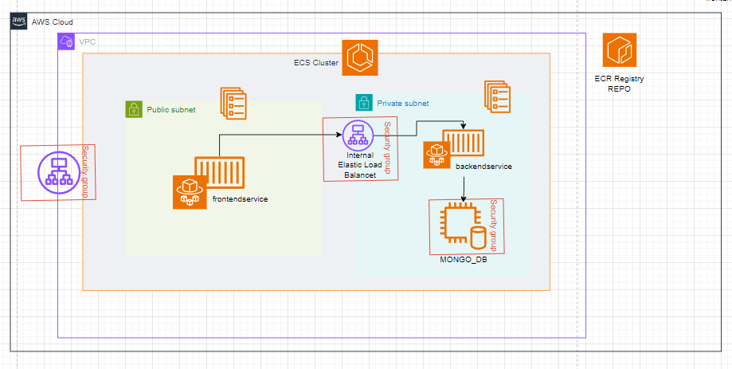

# PREGUNTA 2

Diseñar la infraestructura para un proyecto de microservicios en contendores (Nodejs, MongoDB) , utilizar los servicios de AWS.

## ARQUITECTURA
### CONTENEDORES
1. Para manejar los componentes contenerizados, en el ejemplo un clásico componente de frontend y otro de backend. Para esto tenemos las opciones:
    - Cluster ECS
    - Cluster EKS
Dada la poca complejidad de la aplicación tiene mas sentido usar ECS para gestionar el cluster, además no se especifica el uso de Kubernetes, por lo que elegimos ECS.
    #### SEGURIDAD
    Usaremos subredes publicas y privadas para el despliegue de recursos de manera segura.
    - Subred Pública: Aloja el frontendservice, que es el punto de contacto con los usuarios finales. Este enfoque permite el acceso directo a Internet y la capacidad de interactuar con servicios externos.
    - Subred Privada: Contiene el backendservice, que debe tener acceso restringido para proteger la lógica de negocio y los datos. La conexión directa con la base de datos MongoDB se establece dentro de esta subred privada, lejos del acceso público directo.

2. Con el fin de separar y desacoplar mejor los componentes usaremos un servicio para cada uno. Además por prácticas de seguridad tendremos la siguiente distribución:
- Componente frontend en subred pública
- Componente de bakend en subred privada, ya que tiene conexión directa con la base de datos Mongo.

3. Para el despliegue de los contenedores podemos usar:
- ECS Instances, que despliega instancias EC2 con el agente ECS. Sin embargo, esto puede dificultar el proceso de gestion de la infraestructura, actualizaciones y demás.
- AWS Fargate: Fargate es un servicio serverless para lanzar contenedores, no tenemos que preocuparnos por la infraestructura subyacente y facilita el enfoque en el desarrollo de la aplicación y no la gestión de infraestrcutura.

4. Construcción y almacenar los contenedores. Si no tenemos un repositorio externo, lo ideal será usar ECR Registry para almacenar nuestros contenedores y ECS los pueda desplegar desde allí.

### BASE DE DATOS
Tenemos unas cuantas opciones en AWS para desplegar una base de datos MONGO, si bien no hay una nativa si contamos con algunas compatibles.
- Document DB: Es un servicio gestionado comptible con Mongo, pero puede sr mas costoso y no ser compatible con las utlimas versiones. Dado que no se especifica la version en el planteamiento es mejor optar por una isntancia que podemos costumizar.
- EC2 instance con una Mongo instalado, esto nos da control total sobre la version, manejar costos y la flexibilidad. Podriamos evaluar una instancia reservada para optimizar costos.

### NETWORKING
Un balanceador de carga es indispensable para manejar el tráfico dirigido al frontend entre las tareas que pueda tenr el servicio de frontend, proporcionan un unico punto de acceso y maneja conexiones seguras HTTPS.
Es buena practica usar un balanceador de carga interno al backend, de esta forma se comunican los 2 servicios.

### SEGURIDAD
- Grupos de seguridad.
Se deben gestionar grupos de seguridad para los servicios y para la base de datos.
FRONTEND
    - Permitir todo el tráfico de entrada desde cualquier punto 0.0.0.0/0 al puerto HTTPS.
BACKEND
    - Permitir solo el tráfico entrante desde el SG del balanceador de carga interno hacia el puerto donde corre el servicio backend.
BASE DE DATOS
    - Limitar el tráfico de entrada solo desde el SG del backend hacia el puerto de la DB, usualmente 27017 para Mongo.

### CONSIDERACIONES
- En caso de que la aplicacion requiera almacenar 

### MEJORAS
- Se debe considerar levantar el proyecto a través de alguna herramienta IaC como Terraform o CodePipeline de AWS. Como pequeño ejemplo se definio un archivo de configuración de Terraform para levantar una base de datos con MongoDB en servicio. [Script]()

- 